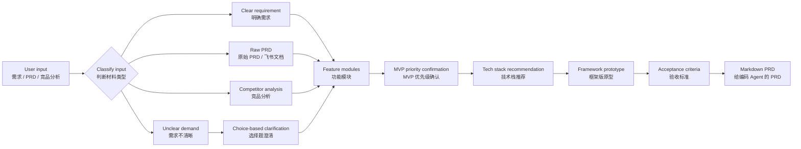

# PRD Converter

> 中文：把需求、原始 PRD、竞品分析，转换成可直接交给 Claude Code / Codex 的 Vibe Coding PRD。  
> English: Convert rough requirements, raw PRDs, and competitor analysis into implementation-ready Vibe Coding PRDs for Claude Code / Codex.


## Visual Workflow / 可视化流程



## What It Does / 它能做什么

| 中文 | English |
|---|---|
| 判断输入属于明确需求、原始 PRD、竞品分析还是需求不清晰。 | Classifies input as clear requirements, raw PRDs, competitor analysis, or unclear demand. |
| 从原始 PRD 中提炼编码 Agent 必须知道的信息，去掉商业价值和空泛背景。 | Extracts implementation-critical information and removes business-value prose. |
| 用选择题引导用户补齐真实需求，避免强行脑补。 | Uses choice-based clarification to avoid guessing hidden intent. |
| 设计 MVP 功能清单、技术栈、核心界面、功能明细和验收标准。 | Designs MVP scope, tech stack, core interface, detailed features, and acceptance criteria. |
| 输出精简 Markdown PRD，可直接交给 Claude Code / Codex。 | Outputs a concise Markdown PRD ready for Claude Code / Codex. |

## Repository Structure / 仓库结构

```text
PRD_converter/
├── README.md
└── prd-converter/
    ├── SKILL.md
    └── agents/
        └── openai.yaml
```

## Trigger / 触发方式

中文：

```text
帮我写一个用来vibe coding的PRD
```

English:

```text
Use $prd-converter to turn my rough requirement or PRD into a concise Vibe Coding PRD.
```

## Output Shape / 输出结构

The skill produces a compact Markdown PRD with these sections:

| Section | 中文说明 |
|---|---|
| Requirement Definition | 需求定义：给谁、什么场景、解决什么问题、产品形态 |
| MVP Scope | MVP 范围：当前做什么、不做什么、优先级原因 |
| Recommended Tech Stack | 技术栈推荐：给技术小白的实现建议 |
| Core Prototype | 框架版原型：核心页面、操作、状态 |
| Functional Design | 功能设计：模块、流程、数据、规则、异常 |
| AI Agent Design | AI 产品专用：Agent 工作流、提示词、工具体系 |
| Acceptance Criteria | 验收标准：可观察、可点击、可验证 |
| Implementation Notes | 给编码 Agent 的实现备注 |

## Installation / 安装

Copy the `prd-converter` folder into your Codex skills directory:

```bash
~/.codex/skills/prd-converter
```

Then restart Codex to pick up the new skill.

将 `prd-converter` 文件夹放入你的 Codex skills 目录：

```bash
~/.codex/skills/prd-converter
```

然后重启 Codex，即可加载该 Skill。

## Design Principles / 设计原则

- Concise over verbose: keep only what a coding agent needs.
- Confirm before final output: clarify scope, MVP priority, and interface direction first.
- No hidden assumptions: ask before inferring user intent.
- Observable acceptance criteria: every included feature must be testable.

中文原则：

- 精简优先：只保留编码 Agent 真正需要的信息。
- 先确认再输出：先确认范围、MVP 优先级和核心界面。
- 不脑补需求：不确定就用选择题澄清。
- 验收可观察：每个功能都要能被明确验证。
